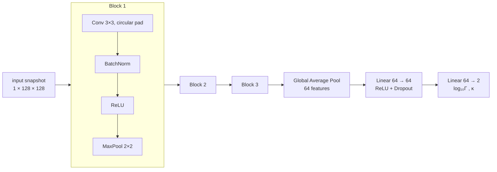
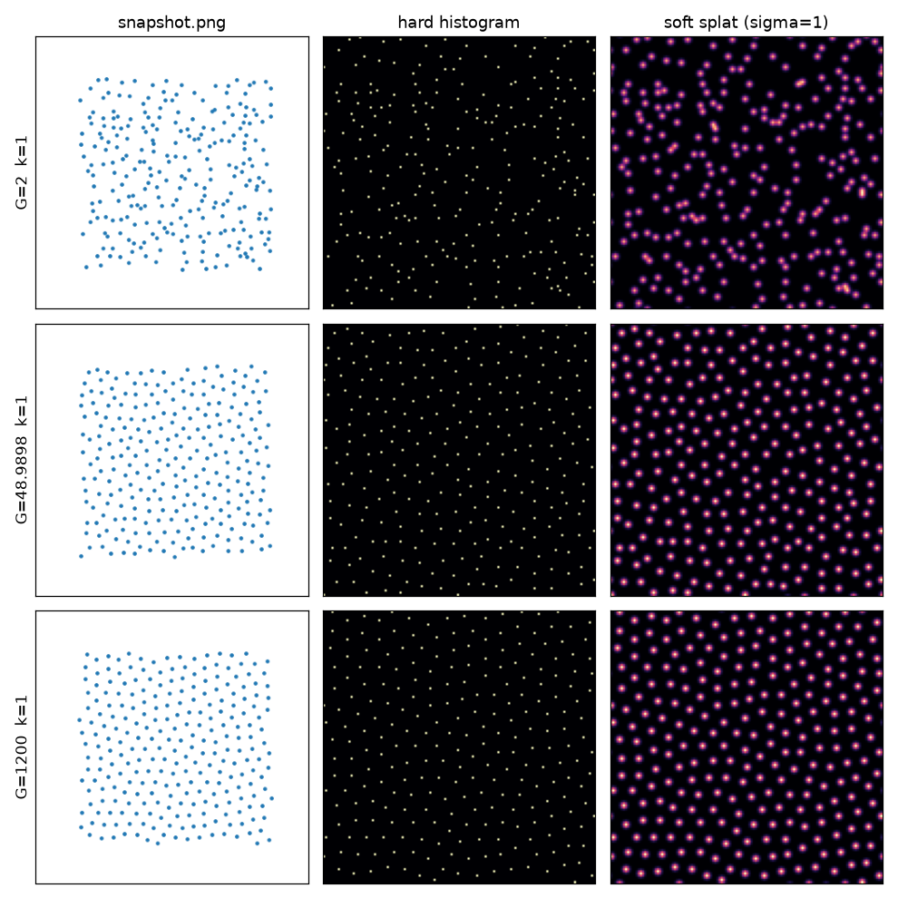

# CNN for Predicting the Coupling and Screening Parameters of a Dusty Plasma from a Single Snapshot

<p align="center">
  
  
  
</p>

A convolutional neural network that reads a single static snapshot of a 2D Yukawa (dusty) plasma — just particle positions, no dynamics — and predicts the two parameters that define its physical state: the coupling parameter $\Gamma$ and the screening parameter $\kappa$.



*Blocks 2 and 3 repeat the Block 1 recipe with 32 and 64 channels respectively.*

---

## Motivation

$\Gamma$ (the ratio of inter-particle potential energy to thermal energy) and $\kappa$ (the ratio of inter-particle spacing to the plasma screening length) together fix essentially everything about a Yukawa system: its structure, its transport coefficients, and its phase — the system freezes from liquid to crystal as $\Gamma$ crosses the melting line $\Gamma_m(\kappa)$.

The problem is that neither parameter is directly measurable in a dusty-plasma experiment. $\Gamma$ depends on the dust grain charge, which is notoriously difficult to determine, and conventional diagnostics recover the parameters indirectly — by fitting measured pair-correlation functions and velocity data against libraries of reference simulations (Ott & Bonitz 2011 [2]). These methods are non-invasive but data-hungry: they need long, well-tracked particle *trajectories*.

Recent work by Liang, Huang, Lu & Feng (2023) [1] showed that a CNN can recover $\kappa$ and $\Gamma$ from single-particle *dynamics* in both simulations and experiments, and machine learning continues to expand across strongly-coupled dusty plasma research (Mitu et al. 2025 [3]). This project asks the complementary — and cheaper — question:

> **How much of the plasma state can be read from one static frame?**

A snapshot-only diagnostic would be the fastest possible instrument: no particle tracking, no video, applicable to a single camera exposure, and fast enough to monitor an experiment in real time.

> [!NOTE]
> **A note from the developer:** the comments inside the Python files explain the technical and physical reasoning in much more depth than this README. Reading the files in `a_` → `g_` order is the recommended way to understand the pipeline.

---

## The Data

Samples are generated by the molecular-dynamics simulator in the sibling `Simulator/` directory (methodology follows Vollmayr-Lee 2020 [4], in the tradition of Rahman 1964 [5]) and are **not tracked in this repository** — regenerate them locally and point `g_configs.py` at the folder.

```text
datasets/
├── data_27pts/          # pilot dataset — 27 samples (3×3 grid × 3 seeds)
└── data_2000pts/        # first full dataset — 2000 samples
    ├── manifest.csv     # index: sample_id, gamma, kappa, seed
    ├── sample_0000/
    ├── sample_0001/
    ├── ...
    └── sample_1999/
        ├── metadata.npy    # [Γ, κ, N] — the ground truth for this sample
        ├── positions.npy   # (N, 2) array of every particle's position
        └── snapshot.png    # rendered view, for human inspection only
```

The full dataset covers a 10 × 10 grid of the phase plane — $\Gamma$ log-spaced from 2 to 1200, $\kappa$ linear from 1 to 3 — with 20 independent seeds per cell.

Each sample consists of three files:

1. **`metadata.npy`** — three floats: the true $\Gamma$ (coupling parameter), $\kappa$ (screening parameter), and $N$ (particle count). These are the regression targets.
2. **`positions.npy`** — an $(N, 2)$ array of particle coordinates. This is what gets rasterized and fed to the CNN.
3. **`snapshot.png`** — purely for human review; the pipeline never touches it.

---

## Repository Structure

Seven modules, prefixed `a_` through `g_` in pipeline order:

| file | role |
|:-----|:-----|
| `a_imports.py` | Single import hub — every other file starts with `from a_imports import *` instead of repeating library imports. |
| `b_rasterize.py` | First stage of the pipeline: converts each sample's `positions.npy` into an image the CNN can ingest. Run directly to produce a visual sanity-check figure. |
| `c_dataset.py` | Data retrieval: reads the manifest, performs the stratified train/val/test split, and serves `(image, target)` pairs to the model. |
| `d_model.py` | The CNN itself, isolated in one file for clarity. Architecture details discussed below. |
| `e_train.py` | The heart of the repository: builds datasets and loaders, sets the loss criterion and optimizer, and runs the standard train/validate loop with checkpointing. |
| `f_eval.py` | Evaluation: scores the trained checkpoint on held-out data — MAE and R² in physical units — and renders the diagnostic plots. |
| `g_configs.py` | Every tunable knob and directory path in one place, so train and eval always stay in lockstep. |

---

## Rasterization

<p align="center">
  
</p>

We deliberately do **not** train on `snapshot.png`: an input pipeline should be lossless and under our control up to the last moment, not shaped by a plotting library's choices. Instead, `b_rasterize.py` builds the image from raw positions:

1. **2D histogram** — the periodic simulation box (side length $L = \sqrt{\pi N}$, from the Wigner–Seitz normalization) is divided into a `RESOLUTION × RESOLUTION` grid (default 128) and particles are binned into pixels.
2. **Gaussian blur** — each particle-dot is smeared into a blob of width `BLOB_SIGMA` (in pixels, default 1.0), with periodic wrap-around matching the box's boundary conditions. This is a tunable noise-robustness ↔ structural-sharpness dial: more blur suppresses seed-specific noise, less blur preserves the sharp lattice signal that distinguishes crystals.
3. **Fixed normalization** — the image is rescaled so its mean pixel value is 1 (nets train best on order-1 inputs). Crucially this is the *same* rescale for every image — we never per-image standardize, because liquids and crystals differ *by* their variance, and that difference is precisely the $\Gamma$ signal being predicted.

An extensive tuning guide for both knobs lives in the comments of `b_rasterize.py`.

---

## The Model

Three convolutional blocks (16 → 32 → 64 channels), each `Conv 3×3 → BatchNorm → ReLU → MaxPool 2×2`, followed by global average pooling and a small linear head that outputs $[\log_{10}\Gamma,\ \kappa]$.

Design choices, and how principled each one actually is:

- **Circular padding** (physics-driven): the simulation box is periodic, so convolutions wrap around exactly as the physics does. A particle at the left edge genuinely neighbors one at the right edge.
- **Regression in $\log_{10}\Gamma$** (physics-driven): $\Gamma$ spans three orders of magnitude (2 → 1200). Regressing raw values would let high-$\Gamma$ samples dominate the loss; log-space makes every decade count equally. Predictions are decoded back to physical units for evaluation.
- **Global average pooling instead of flatten** (physics-driven): with periodic boundaries, absolute position carries no information — the system is translation-invariant, and GAP averages spatial information away, matching that symmetry exactly. It also cuts the parameter count drastically, which matters on small datasets.
- **Three blocks, 16/32/64 channels, hidden width 64** (convention, not validated): standard small-CNN sizing. We have not ablated depth or width; these numbers are honest defaults, not optimized choices.
- **Dropout 0.3** (convention, not validated): a customary regularization strength, untested against alternatives.

---

## The Training Loop

`e_train.py` follows the standard PyTorch recipe — per batch: zero gradients → forward → loss → backward → optimizer step — with a validation pass and checkpoint-on-improvement each epoch.

- **Loss: Smooth L1.** Quadratic near zero (stable, well-behaved gradients when close), linear for large errors (a single bad snapshot cannot dominate a batch the way it would under MSE).
- **Optimizer: Adam** with default parameters and mild weight decay.

Both choices follow Liang et al. [1], who used exactly this pairing (Smooth L1 + default Adam) for CNN-based $\kappa$ regression in dusty plasmas, and on reflection the robustness argument applies directly to our use case, so we adopted it.

Running the script prints per-epoch train/validation losses and saves the best-on-validation weights to `checkpoints/best.pt`.

---

## How to Run

Requires Python 3.11. From the repository root:

```bash
# one-time setup
python3.11 -m venv .venv
source .venv/bin/activate
pip install -r requirements.txt

# 1. sanity-check the rasterizer (writes Diagnostics/outputs/rasterize_check.png)
python3 b_rasterize.py

# 2. train — tee the console output into the diagnostics log
python3 e_train.py | tee Diagnostics/training.txt

# 3. evaluate the best checkpoint (writes metrics + plots to Diagnostics/outputs/)
python3 f_eval.py
```

Dataset location, resolution, split fractions, and all hyperparameters are set in `g_configs.py`.

---

## Diagnostics

Our two headline metrics:

- **MAE (mean absolute error)** — the average $|\text{prediction} - \text{truth}|$, reported in *physical units*, so "$\Gamma$ MAE = 161" means predictions miss by 161 on average. 
- **R²** — how much of the variance in the true values the predictions explain: 1 is perfect, 0 is no better than always guessing the mean, negative is worse than that. It Answers whether it *hass there real predictive skill?*

A training run populates the `Diagnostics/` directory:

```text
Diagnostics/
├── how_to_use.txt      # detailed guide: reading these files and deciding what to change
├── training.txt        # per-epoch train/val losses + best-so-far val loss
└── outputs/
    ├── metrics.txt         # MAE and R² for Γ, κ, and log₁₀Γ on the held-out split
    ├── pred_vs_true.png    # parity plots — every dot is one held-out sample
    ├── error_heatmap.png   # mean relative Γ error per (Γ, κ) cell of the phase plane
    └── rasterize_check.png # rasterizer sanity check from the initial pipeline run
```

In brief: `training.txt` tells you whether learning happened and when overfitting began; `metrics.txt` gives the headline numbers; `pred_vs_true.png` shows *what kind* of wrong the model is (bias vs noise vs hedging-to-the-mean); `error_heatmap.png` shows *where* in the phase plane it struggles — watch the melting line. For the full reading guide, see [`Diagnostics/how_to_use.txt`](Diagnostics/how_to_use.txt).

> [!TIP]
> These diagnostics earn their keep: the pilot run's `R² = nan` for $\Gamma$ exposed a real train/val split bug — documented in commit [`88d75e3`](https://github.com/KushmanG/YDP-Convolutional-Neural-Network/commit/88d75e3) and fixed by the stratified split in `c_dataset.py`.

---

## Credits

- **Kushman Goyal** — physics, pipeline design, and implementation.
- **Claude (Anthropic)** — `f_eval.py` including all plot styling (Opus 4.8), the rasterization check figure formatting (Opus 4.8), the dataset class and target encoding plus the split-bug diagnosis (Fable 5).

### References

[1] C. Liang, D. Huang, S. Lu, and Y. Feng, *Determining global property of dusty plasma from single particle dynamics using machine learning*, [Phys. Rev. Research **5**, 033086 (2023)](https://doi.org/10.1103/PhysRevResearch.5.033086).

[2] T. Ott and M. Bonitz, *Effective coupling parameter for 2D Yukawa liquids and non-invasive measurement of plasma parameters*, [Phys. Plasmas **18**, 063701 (2011)](https://arxiv.org/abs/1010.6193).

[3] M. L. Mitu et al., *Machine learning-based prediction of microparticle dynamics in externally driven strongly-coupled dusty plasmas*, [Mach. Learn.: Sci. Technol. **6**, 045009 (2025)](https://doi.org/10.1088/2632-2153/ae0c54).

[4] K. Vollmayr-Lee, *Introduction to molecular dynamics simulations*, [Am. J. Phys. **88**, 401 (2020)](https://doi.org/10.1119/10.0000654).

[5] A. Rahman, *Correlations in the Motion of Atoms in Liquid Argon*, [Phys. Rev. **136**, A405 (1964)](https://doi.org/10.1103/PhysRev.136.A405).
